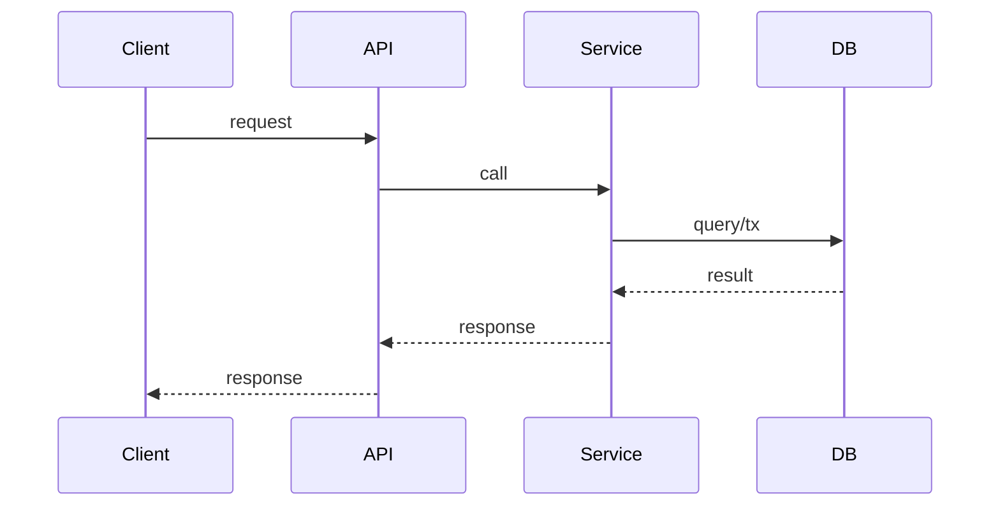
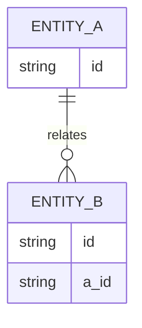

# DD — <Task ID> <Title>

- Task ID：T0001 / T0001-1
- 状态：Draft | Reviewed | Approved
- 关联：`docs/tasks/taskbook.md` 中对应段落

## 1. 背景与目标
## 2. 范围与非目标
## 3. 现状与问题
## 4. 方案与取舍
## 5. 接口设计（与 docs/interfaces/api.md 对齐）
## 6. 数据设计（迁移/回滚）

## 7. 时序图（强制）

## 8. ER 图（强制）

## 9. 接口时序/调用编排（强制）
## 10. 测试方案（必须自动化 + 覆盖历史 bug）
## 11. 安全与合规
## 12. 性能与容量
## 13. 风险清单
## 14. 回滚方案
## 15. 影响面与发布计划
