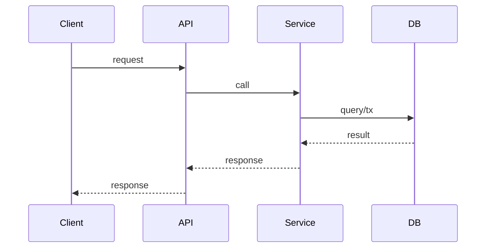
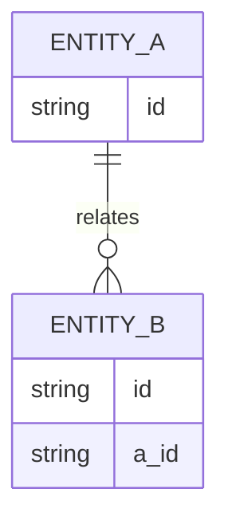

# DD — <Task ID> <Title>

- Task ID：T0001 / T0001-1
- 状态：Draft | Reviewed | Approved
- 关联：`docs/tasks/taskbook.md` 中对应段落

## 1. 背景与目标
## 2. 范围与非目标
## 3. 现状与问题
## 4. 方案与取舍
## 5. 架构落位与复用检查
- 目标层级：Domain / Application / Infrastructure / Interface / Shared / Tooling
- 既有复用点：
- 是否需要 ADR：Yes / No；如 Yes，记录到 `docs/architecture/adr/`
- 是否触及大文件 / 大组件：

## 6. 接口设计（与 docs/interfaces/api.md 对齐）
## 7. 数据设计（迁移/回滚）

## 8. 时序图（强制）

```mermaid
sequenceDiagram
  participant C as Client
  participant A as API
  participant S as Service
  participant D as DB
  C->>A: request
  A->>S: call
  S->>D: query/tx
  D-->>S: result
  S-->>A: response
  A-->>C: response
```

## 9. ER 图（强制）

```mermaid
erDiagram
  ENTITY_A ||--o{ ENTITY_B : relates
  ENTITY_A { string id }
  ENTITY_B { string id string a_id }
```

## 10. 接口时序/调用编排（强制）
## 11. 测试方案（必须自动化 + 覆盖历史 bug）
## 12. 安全与合规
## 13. 性能与容量
## 14. 风险清单
## 15. 回滚方案
## 16. 影响面与发布计划
